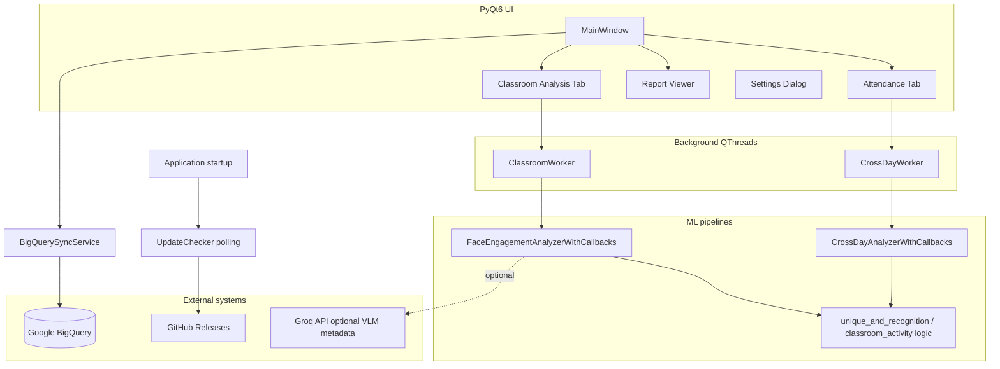

# TataStrive Analytics — Product Documentation

**Version:** 3.0.0 (see `app/__init__.py`)  
**Product type:** Windows desktop application (PyQt6 + Python, optionally packaged with PyInstaller)  
**Primary use:** CCTV-based **classroom engagement** analysis and **multi-day attendance** tracking with optional cloud sync to Google BigQuery.

This document is a **product and technical overview** for stakeholders, operators, and maintainers. Step-by-step install and quick usage remain in [README_APP.md](README_APP.md); installer packaging is in [installer/README.md](installer/README.md).

---

## 1. Product overview

### 1.1 Purpose

TataStrive Analytics turns recorded classroom or training-center video into structured reports:

1. **Classroom Analysis** — Periodically samples the video (“probes”), estimates how many people are present, class mode (e.g. lecture vs activity), and engagement-style signals, then writes JSON reports suitable for dashboards or archival.
2. **Attendance only (cross-day)** — Detects and tracks faces over time, maintains a **master identity database** across days, labels people as returning vs visitors, optionally matches against a known student embedding database, and emits daily attendance JSON (and optional annotated video).
3. **Report Viewer** — Loads those JSON files into table/tree views and supports CSV export.
4. **BigQuery sync** — Optionally uploads attendance and engagement rows to a centralized BigQuery dataset, tagged by **center ID** so many sites can share one warehouse.
5. **Silent updates** — Can poll GitHub Releases and apply delta patches without reinstalling the full application.

### 1.2 Typical users

| Role | Typical workflow |
|------|------------------|
| **Center operator** | Set center ID once; point app at a **watch folder** for new videos; pick output folder; start monitoring; let runs finish and sync to BigQuery if credentials are present. |
| **Analyst / manager** | Open Report Viewer or query BigQuery for trends across centers and dates. |
| **IT / deployment** | Build `exe` + installer; place `credentials.json` next to the executable for BigQuery; manage `.env` for optional API keys. |

### 1.3 First-launch experience

On first run, the app prompts for a **Center ID** (stored in config). This value is attached to every BigQuery row for multi-site isolation. PyTorch must load for analysis tabs; if it fails, the app offers **limited mode** (Report Viewer only).

---

## 2. System architecture

### 2.1 High-level diagram

### 2.2 Entry points and packaging

| Path | Role |
|------|------|
| `run_app.py` / `python -m app.main` | Standard development launch. |
| `app/main.py` | Boots `QApplication`, High DPI, stylesheet, optional ONNX preload for Windows DLL order, **merges partial `app/` overlay** next to frozen exe with bundled `_internal` tree (delta updates). |
| `build_exe.py` | Produces `dist/TataStriveAnalytics/` (PyInstaller onedir-style layout). |

Frozen builds: CUDA is forced off via `CUDA_VISIBLE_DEVICES=""` at the very start of `main.py` to reduce DLL failures on classroom PCs.

### 2.3 Core Python packages

- **UI:** PyQt6  
- **Vision / ML:** PyTorch, Ultralytics YOLO, BoTSORT-style tracking (boxmot), InsightFace, ONNX Runtime (face path), OpenCV  
- **Optional:** Groq vision API for classroom/date metadata (via `.env`)  
- **Cloud:** `google-cloud-bigquery` + service account JSON (lazy import so the app starts without BigQuery libs)

---

## 3. User interface

### 3.1 Main window (`app/ui/main_window.py`)

- **Tabs:** Classroom Analysis, Attendance only, Report Viewer  
- **Toolbar:** Settings (Ctrl+,), **Sync to BigQuery** (Ctrl+Shift+S)  
- **Menus:** File (open folder/report, settings, exit), View (tab shortcuts Ctrl+1–3), BigQuery (sync, change center, open console), Help (About)  
- **Status bar:** Ready/limited mode, permanent **Center** label, version label  
- **Signals:** Completing classroom or attendance analysis can trigger follow-up actions (e.g. sync notifications via `on_bq_sync_done`)

### 3.2 Classroom Analysis tab (`app/ui/classroom_tab.py`)

- **Folder-based workflow:** User selects a **video input folder** and **output directory**, not a single file.  
- **Start Monitoring:** A timer polls the folder (e.g. every 5 seconds) for new video files; completed videos are tracked in config so **restarts and app updates do not reprocess** the same file.  
- **Progress + logs:** `ProgressPanel` shows worker progress and messages.  
- **Preview:** Optional live preview via `VideoPreview` (driven by worker `frame_ready` signals).  
- **Parameters** (defaults and tuning): Primarily from **Settings** → `classroom` and `inference` sections in `config.json`.

### 3.3 Attendance only tab (`app/ui/crossday_tab.py`)

- **Folder monitoring:** Same pattern as classroom tab (watch folder, output folder, persisted completed list).  
- **Database file:** User picks an existing **`.db` or `.pkl`** master database, or leaves empty for **day one**.  
- **Run mode auto-detection:** If a database file exists → **EVAL_DAY** (match against gallery); if not → **BUILD_DB** (create baseline).  
- **Day label:** Derived from today’s date (e.g. `DayMMDD`) for run naming.  
- **Thresholds / face pipeline:** Settings dialog → `crossday` and shared `inference` keys.

### 3.4 Report Viewer (`app/ui/report_viewer.py`)

- Opens JSON reports manually or scans **last known output directories** from config for patterns such as `*attendance_report*.json`, `*class_dynamics_report*.json`, `*management_summary_report*.json`.  
- **Table and tree** views; **CSV export** where applicable.

### 3.5 Settings (`app/ui/settings_dialog.py`)

Grouped tabs align with config sections: classroom defaults, attendance (cross-day) thresholds, inference device options (e.g. OpenVINO toggle, CPU force, YOLO / face input sizes, frame skip, preview backend), window geometry, and BigQuery auto-sync schedule.

### 3.6 Keyboard shortcuts

| Shortcut | Action |
|----------|--------|
| Ctrl+O | Open input folder (main window) |
| Ctrl+R | Open report |
| Ctrl+, | Settings |
| Ctrl+1 / 2 / 3 | Classroom / Attendance / Report Viewer |
| Ctrl+Shift+S | Sync to BigQuery |

---

## 4. Processing pipelines

### 4.1 Classroom analysis worker (`app/workers/classroom_worker.py`)

- Runs in a **QThread** to keep the UI responsive.  
- Emits **progress**, **log**, **frame** (preview), **finished** (report path), or **error**.  
- Implements (or delegates to) **FaceEngagementAnalyzerWithCallbacks** — documented in code as aligned with the integrated classroom pipeline (**V14** lineage / `classroom_activity_1.py`).  
- Uses **config** keys under `classroom` (probe duration/interval, frame skip, track stitching similarity, time gap, pixel distance, optional delete-after-process) and **inference** (YOLO size, face det size, frame skip, OpenVINO, preview mode).  
- **Outputs** (typical): `class_dynamics_report.json`, `stitching_index.json` (see [README_APP.md](README_APP.md)).

### 4.2 Attendance worker (`app/workers/crossday_worker.py`)

- **QThread** wrapper around **CrossDayAnalyzerWithCallbacks**, conceptually aligned with `cross_day_code` / `unique_and_recognition.py` behavior but with GUI callbacks.  
- **Face gallery logic:** Cosine similarity thresholds (`t_strict_merge`, `t_new_id`, `t_ratio_margin`), minimum samples/embeddings for matching, exemplar caps, visitor upgrade after N days, optional student DB match threshold.  
- **Optional features:** Motion detection toggle, OCR timestamp extraction from a ROI (`timestamp_coords`, `ocr_interval`), output annotated video, delete-after-processing.  
- **ONNX / InsightFace:** If ONNX Runtime fails to load, the product can still operate in a **reduced** track-oriented mode (see troubleshooting in README).  
- **Outputs:** Daily `*_attendance_report.json`, optional `*_output.mp4`, crop folders, `Verification_Matches` on eval days, updated `master_database` artifact.

### 4.3 Standalone scripts (`unique_and_recognition.py`)

The repository retains a **script-style** attendance pipeline for batch or development use. The **desktop app** should be treated as the supported operator path; the script shares model paths and similar concepts under `models/` / `Models/`.

---

## 5. Configuration reference

**Location:** `~/.tatastrive/config.json` (Windows: `C:\Users\<user>\.tatastrive\config.json`)  
**API:** `ConfigManager` in `app/config.py` — **dot notation** for `get`/`set`, deep merge with defaults when the file is upgraded.

### 5.1 Top-level keys (summary)

| Key | Meaning |
|-----|---------|
| `center_id` | Site identifier for BigQuery and UI title. |
| `last_*` paths | Last folders for video input, output, DB (persisted convenience). |
| `crossday_completed_videos` / `classroom_completed_videos` | Per-folder lists of finished video paths (idempotent monitoring). |
| `bigquery` | `auto_sync`, `sync_hour` (UTC), `last_sync_date`. |
| `classroom` | Probe timing, frame skip, stitching, optional delete video. |
| `crossday` | Face matching thresholds, OCR, motion, output options, student DB path. |
| `inference` | Device/backend, YOLO and face sizes, frame skip, preview. |
| `preview_enabled` | Global preview toggle behavior coordination. |
| `window` | Width, height, position. |

### 5.2 Migration behavior

`ConfigManager` migrates older strict face defaults when `face_match_defaults_revision` is behind current revision, so legacy installs pick up safer defaults without manual JSON surgery.

---

## 6. BigQuery integration

**Module:** `app/bigquery_sync.py`  
**Project / dataset (as shipped in code):** `PROJECT_ID` = `tatastrive-269409`, `DATASET_ID` = `tatastrive_analytics`.

### 6.1 Tables

| Table | Content |
|-------|---------|
| `attendance_reports` | Flattened attendance JSON: session metadata, counts, repeated per-person fields (person id/type, times, confidence, rolling presence hints). |
| `engagement_reports` | Classroom engagement: classroom name, probe rows, durations by mode, distributions as JSON strings, etc. |
| `sync_log` | Per-file sync audit: status, rows inserted, errors; may include **videos still in queue** after auto-sync for folder-listener workflows. |

Every row carries **`center_id`** and a **sync timestamp** for lineage and deduplication strategies upstream.

### 6.2 Credentials

The service resolves a **service account JSON** from (in order): next to the executable (`credentials.json`, `Creds/credentials.json`), under `app/Creds/`, repo root, or `GOOGLE_APPLICATION_CREDENTIALS`. Packaged installs are expected to place credentials **next to the exe** on the target PC.

### 6.3 When sync runs

- **Auto:** If `bigquery.auto_sync` is true, startup triggers **daily sync** (once per calendar day semantics via `last_sync_date`), scanning recent outputs from last classroom and cross-day output directories.  
- **Manual:** Toolbar/menu **Sync to BigQuery** pushes the same logic on demand.

If BigQuery libraries or credentials are missing, sync is skipped or degraded gracefully (the UI should still work).

---

## 7. Updates and releases

**Module:** `app/updater.py`  
**Mechanism:** Background polling of **GitHub Releases API** for the configured repo (`TATASTRIVE_GITHUB_REPO` env override, default owner/repo embedded in code).  
**Delta delivery:** Downloads a **patch ZIP** containing only changed files; extracts over the install folder; clears relevant `__pycache__` so new `.py` overlays load; **restarts** the process.  
**UX:** Silent by default (`silent_auto_apply=True`) — no modal update wizard.

**Note:** `DEFAULT_POLL_INTERVAL_MINUTES` may be set low during development; tune upward for production to reduce API traffic.

---

## 8. Outputs and file naming

Operators and integrators should expect JSON as the **system of record** for downstream analytics.

| Mode | Typical artifacts |
|------|-------------------|
| Classroom | `class_dynamics_report.json`, `stitching_index.json` |
| Attendance | `{date}_attendance_report.json`, optional annotated MP4, `master_database.pkl`/`.db`, `crops_*`, `Verification_Matches/` |

Report Viewer and BigQuery loaders depend on these schemas staying compatible; coordinate schema changes with migration scripts (the repo includes SQL helpers under `installer/` and utilities under `scripts/` for BigQueue repair/sync).

---

## 9. Operational playbooks

### 9.1 New center onboarding

1. Install app (or unzip portable build).  
2. Run once; set **Center ID**.  
3. Place **BigQuery `credentials.json`** beside the executable if cloud sync is required.  
4. Confirm `config.json` `bigquery.auto_sync` and `sync_hour` (UTC) match operations policy.  
5. Train operators on **watch folder** workflow and on **BUILD_DB** vs **EVAL_DAY** (empty DB path vs existing DB).

### 9.2 Day-one vs ongoing attendance

- **Day one:** No DB file selected → build master gallery from video(s) in the watch folder.  
- **Later days:** Point to the **same logical master DB** file produced earlier (copied or shared path) → evaluation mode matches new faces to existing IDs and updates visitor/returning statistics.

### 9.3 Large videos and weak PCs

- Increase **frame skip** (classroom and/or inference).  
- Disable **preview**.  
- Prefer **CPU-only PyTorch** if GPU drivers are unstable (see README).  
- Reduce input resolution at the camera or re-encode if memory errors persist.

---

## 10. Security and privacy considerations

- **Video and face crops** stay on disk paths the operator chooses; the app does not upload raw video to BigQuery — only **structured report JSON** fields defined in schemas.  
- **Service account JSON** is highly sensitive; restrict file ACLs on shared machines.  
- **Groq API key** in `.env` is optional; do not commit `.env` to version control (use `.env.example` as a template).  
- **Center ID** is not a cryptographic control; it is a **tenant tag** — combine with IAM and dataset policies on the cloud side.

---

## 11. Troubleshooting matrix

| Symptom | Likely cause | Pointer |
|---------|----------------|---------|
| Analysis tabs disabled | PyTorch DLL failure | Limited mode dialog; CPU PyTorch / VC++ redist ([README_APP.md](README_APP.md)) |
| Face / ONNX errors | Wrong onnxruntime wheel or DLL path | README “onnxruntime” section; Windows DLL search paths in `main.py` |
| NumPy version error | NumPy 2.x vs old PyTorch | Pin NumPy < 2 or upgrade PyTorch ([README_APP.md](README_APP.md)) |
| BigQuery not syncing | Missing creds or libraries | Check `_creds_path()` locations and install optional deps |
| Same video re-queued | Completed videos list for another folder | Ensure watch folder path matches persisted `*_completed_videos` |

---

## 12. Repository map (maintainers)

| Area | Path |
|------|------|
| Application package | `app/` |
| UI tabs & widgets | `app/ui/`, `app/ui/widgets/` |
| Workers | `app/workers/` |
| Config | `app/config.py` |
| BigQuery | `app/bigquery_sync.py` |
| Updater | `app/updater.py` |
| Styles / icons | `app/resources/` |
| Build script | `build_exe.py` |
| Windows installer | `installer/` |
| Requirements | `requirements_app.txt` |
| Attendance reference script | `unique_and_recognition.py` |

---

## 13. License

Proprietary — TataStrive (see [README_APP.md](README_APP.md)).

---

*Document generated to describe the product as of the codebase version in `app/__init__.py`. For exact dependency versions and install commands, always refer to `requirements_app.txt` and README files in the repository root.*
